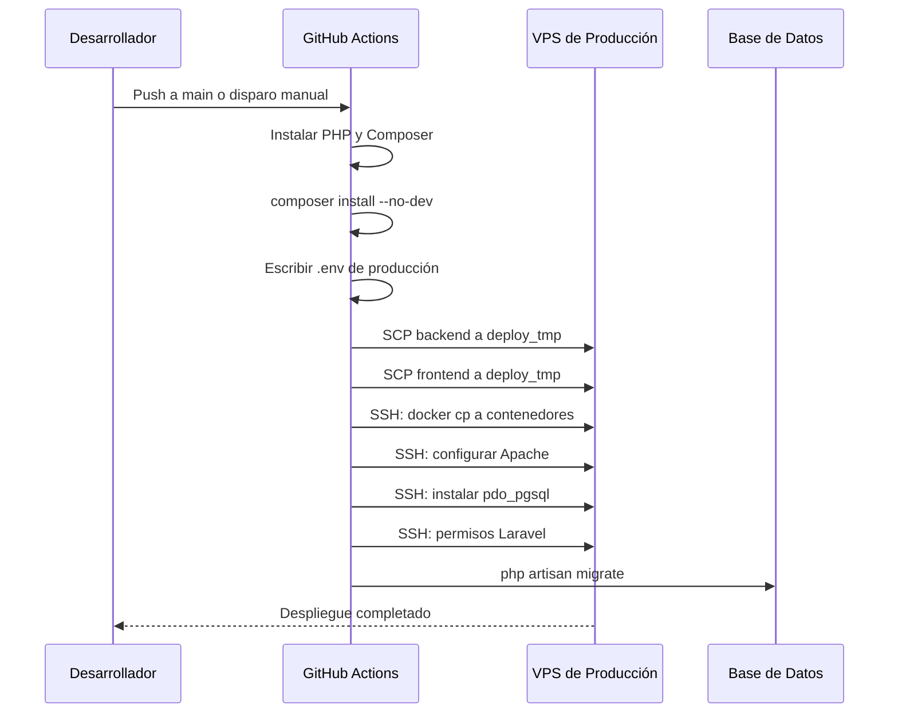

DESPLIEGUE

Gimnasio Zeus - Proyecto
Arquitectura del sistema
El proyecto sigue una estructura monorepositorio, separando la lógica del lado del servidor de la interfaz del lado del cliente. Esta separación permite que el backend funcione como una API REST pura mientras que el frontend permanece como un sitio estático de alto rendimiento.

Componentes principales
1. Backend: Aplicación Laravel (zeusgym-back)
El backend está alimentado por Laravel 12, que actúa como centro de datos. Gestiona la lógica de dominio para tres entidades principales: Miembros, Planes (Planes de Suscripción) y Sedes (Sucursales de Gimnasio). Utiliza Eloquent ORM para interacciones con bases de datos y proporciona una API estructurada para el frontend.

Capa API: Expone los endpoints para operaciones CRUD en los miembros y el acceso de solo lectura a sucursales y planes de gimnasio.
Base de datos: Soporta SQLite para desarrollo local y PostgreSQL para entornos de producción.

2. Frontend: Aplicación web estática (zeusgym-front)
El frontend es una aplicación HTML/JS estándar con estilo CSS Tailwind. Está dividido en dos áreas funcionales principales:

Página de aterrizaje pública: Muestra información sobre gimnasios, ubicaciones en Quito y planes disponibles para los posibles miembros.
Panel de Administración: Una interfaz segura para que el personal gestione la base de datos de miembros.

Despliegue y CI/CD
El proyecto utiliza GitHub Actions para el despliegue automatizado en un VPS. La tubería gestiona la instalación de dependencias mediante Composer, la transferencia de activos vía SCP y la ejecución remota vía SSH para actualizar los contenedores Docker.

# Documentación del Despliegue

El sistema Zeus Gym utiliza un pipeline de CI/CD automatizado mediante GitHub Actions para desplegar la aplicación en un VPS. A continuación se documenta el proceso completo de despliegue.

## Resumen del Proceso

El despliegue se activa automáticamente al hacer push a la rama `main` o manualmente mediante `workflow_dispatch`. El pipeline instala dependencias, transfiere archivos al VPS mediante SCP, y ejecuta comandos SSH para actualizar los contenedores Docker y ejecutar migraciones de base de datos. [1](#0-0) 

## Requisitos Previos

### Secrets de GitHub Configurados

El workflow requiere los siguientes secrets en el repositorio de GitHub:

- `VPS_HOST`: Host del servidor VPS
- `VPS_USER`: Usuario SSH del VPS
- `VPS_SSH_KEY`: Clave privada SSH para autenticación
- `VPS_PORT`: Puerto SSH (por defecto 22)
- `BACKEND_ENV_FILE`: Contenido completo del archivo `.env` de producción

## Flujo de Despliegue

### 1. Configuración del Entorno

El workflow se ejecuta en `ubuntu-latest` y configura PHP 8.2 con Composer. [2](#0-1) 

### 2. Instalación de Dependencias del Backend

Se instalan las dependencias de Laravel en el directorio `zeusgym-back` sin dependencias de desarrollo. [3](#0-2) 

### 3. Configuración del Archivo .env

El archivo `.env` de producción se crea desde el secret `BACKEND_ENV_FILE`. [4](#0-3) 

### 4. Transferencia de Archivos al VPS

#### Backend
Los archivos del backend se copian a una carpeta temporal en el VPS mediante SCP. [5](#0-4) 

#### Frontend
Los archivos del frontend estático se copian de manera similar a otra carpeta temporal. [6](#0-5) 

### 5. Despliegue en Contenedores Docker

Mediante SSH, se ejecutan los siguientes comandos en el VPS:

#### Actualización del Contenedor Backend
- Se elimina el `.env` anterior del contenedor `backzeusgym_container` [7](#0-6) 
- Se copia el nuevo código dentro del contenedor Laravel [8](#0-7) 

#### Actualización del Contenedor Frontend
- Se copia el sitio estático dentro del contenedor nginx `zeusgym_container` [9](#0-8) 

#### Configuración de PostgreSQL
- Se verifica e instala la extensión `pdo_pgsql` si no está presente (esto es necesario porque la extensión se pierde si el contenedor se recrea) [10](#0-9) 

#### Configuración de Apache
- Se configura el `DocumentRoot` para apuntar a `/var/www/html/public` [11](#0-10) 
- Se habilita `AllowOverride All` para que funcione el `.htaccess` de Laravel [12](#0-11) 
- Se habilita el módulo `rewrite` y se reinicia Apache [13](#0-12) 

#### Permisos de Laravel
- Se establecen los permisos correctos para los directorios `storage` y `bootstrap/cache` [14](#0-13) 
- Se limpia la caché de configuración de Laravel [15](#0-14) 

### 6. Migraciones de Base de Datos

El workflow soporta dos modos de migración:

- **Normal**: Ejecuta `php artisan migrate --force` [16](#0-15) 
- **Fresh con Seed**: Si se activa la opción `fresh_seed` en el disparador manual, ejecuta `php artisan migrate:fresh --seed --force` (esto borra todos los datos actuales) [17](#0-16) 

### 7. Limpieza

Finalmente, se elimina la carpeta temporal de despliegue en el VPS. [18](#0-17) 

## Diagrama del Flujo de Despliegue



## Notas

- El contenedor backend utiliza Apache con PHP 8.2 y sirve la aplicación Laravel desde el directorio `/public` [19](#0-18) 
- El contenedor frontend utiliza nginx para servir los archivos estáticos del frontend vanilla HTML/JS [20](#0-19) 
- La base de datos soporta SQLite para desarrollo local y PostgreSQL para producción [21](#0-20) 

### Citas

**File:** .github/workflows/deploy.yml (L1-11)
```yaml
name: Deploy Zeus Gym

on:
  push:
    branches: [main]
  workflow_dispatch:
    inputs:
      fresh_seed:
        description: "Ejecutar migrate:fresh --seed (BORRA todos los datos actuales) en vez de migrate normal"
        type: boolean
        default: false
```

**File:** .github/workflows/deploy.yml (L14-24)
```yaml
  deploy:
    runs-on: ubuntu-latest
    steps:
      - name: Checkout del repositorio
        uses: actions/checkout@v4

      - name: Instalar PHP y Composer
        uses: shivammathur/setup-php@v2
        with:
          php-version: "8.2"

```

**File:** .github/workflows/deploy.yml (L25-27)
```yaml
      - name: Instalar dependencias de Laravel (vendor/ no vive en git)
        working-directory: zeusgym-back
        run: composer install --no-dev --optimize-autoloader --no-interaction
```

**File:** .github/workflows/deploy.yml (L29-33)
```yaml
      - name: Escribir el .env de producción
        working-directory: zeusgym-back
        env:
          ENV_CONTENT: ${{ secrets.BACKEND_ENV_FILE }}
        run: printf '%s' "$ENV_CONTENT" > .env
```

**File:** .github/workflows/deploy.yml (L35-44)
```yaml
      - name: Copiar backend al VPS (carpeta temporal)
        uses: appleboy/scp-action@v0.1.7
        with:
          host: ${{ secrets.VPS_HOST }}
          username: ${{ secrets.VPS_USER }}
          key: ${{ secrets.VPS_SSH_KEY }}
          port: ${{ secrets.VPS_PORT }}
          source: "zeusgym-back/*,zeusgym-back/.env"
          target: "/home/${{ secrets.VPS_USER }}/deploy_tmp/backend"
          strip_components: 1
```

**File:** .github/workflows/deploy.yml (L46-55)
```yaml
      - name: Copiar frontend al VPS (carpeta temporal)
        uses: appleboy/scp-action@v0.1.7
        with:
          host: ${{ secrets.VPS_HOST }}
          username: ${{ secrets.VPS_USER }}
          key: ${{ secrets.VPS_SSH_KEY }}
          port: ${{ secrets.VPS_PORT }}
          source: "zeusgym-front/*"
          target: "/home/${{ secrets.VPS_USER }}/deploy_tmp/frontend"
          strip_components: 1
```

**File:** .github/workflows/deploy.yml (L69-70)
```yaml
            # --- Backend: borrar el .env anterior antes de copiar (defensivo, evita basura previa) ---
            docker exec backzeusgym_container rm -f /var/www/html/.env
```

**File:** .github/workflows/deploy.yml (L72-73)
```yaml
            # --- Backend: copiar código dentro del contenedor de Laravel ---
            docker cp "$TMP/backend/." backzeusgym_container:/var/www/html/
```

**File:** .github/workflows/deploy.yml (L75-76)
```yaml
            # --- Frontend: copiar el sitio estático dentro del contenedor nginx ---
            docker cp "$TMP/frontend/." zeusgym_container:/usr/share/nginx/html/
```

**File:** .github/workflows/deploy.yml (L78-83)
```yaml
            # --- PHP: pdo_pgsql no viene en la imagen base y vive en la capa del contenedor,
            #     no en el volumen, así que se pierde si el contenedor se recrea (ya pasó dos veces) ---
            docker exec backzeusgym_container php -m | grep -qi pdo_pgsql || {
              docker exec backzeusgym_container bash -c "apt-get update -qq && apt-get install -y -qq libpq-dev"
              docker exec backzeusgym_container docker-php-ext-install pdo_pgsql pgsql
            }
```

**File:** .github/workflows/deploy.yml (L85-86)
```yaml
            # --- Apache: DocumentRoot debe apuntar a /public (idempotente: el ancla $ evita reaplicarlo dos veces) ---
            docker exec backzeusgym_container sed -i "s#DocumentRoot /var/www/html\$#DocumentRoot /var/www/html/public#" "$CONF"
```

**File:** .github/workflows/deploy.yml (L88-89)
```yaml
            # --- AllowOverride All para que funcione el .htaccess de Laravel (idempotente) ---
            docker exec backzeusgym_container bash -c "grep -q 'AllowOverride All' $CONF || printf '\n<Directory /var/www/html/public>\n    Options Indexes FollowSymLinks\n    AllowOverride All\n    Require all granted\n</Directory>\n' >> $CONF"
```

**File:** .github/workflows/deploy.yml (L91-97)
```yaml
            docker exec backzeusgym_container a2enmod rewrite
            docker exec backzeusgym_container apache2ctl configtest
            # restart (no graceful): un módulo recién habilitado con a2enmod solo se carga con un restart completo.
            # apache2ctl restart siempre devuelve un código de salida distinto de cero en este contenedor
            # (Apache corre como PID 1 en primer plano y el restart le manda una señal de terminación),
            # aunque el restart en sí funcione bien — por eso el || true, para no cortar el script con set -e.
            docker exec backzeusgym_container apache2ctl restart || true
```

**File:** .github/workflows/deploy.yml (L99-101)
```yaml
            # --- Permisos y caché de Laravel ---
            docker exec backzeusgym_container chown -R www-data:www-data /var/www/html/storage /var/www/html/bootstrap/cache
            docker exec backzeusgym_container chmod -R 775 /var/www/html/storage /var/www/html/bootstrap/cache
```

**File:** .github/workflows/deploy.yml (L102-102)
```yaml
            docker exec backzeusgym_container php artisan config:clear
```

**File:** .github/workflows/deploy.yml (L105-106)
```yaml
            if [ "${{ github.event.inputs.fresh_seed }}" = "true" ]; then
              docker exec backzeusgym_container php artisan migrate:fresh --seed --force
```

**File:** .github/workflows/deploy.yml (L108-109)
```yaml
              docker exec backzeusgym_container php artisan migrate --force
            fi
```

**File:** .github/workflows/deploy.yml (L111-111)
```yaml
            rm -rf "$TMP"
```

**File:** zeusgym-back/.env.example (L23-23)
```text
DB_CONNECTION=sqlite
```


